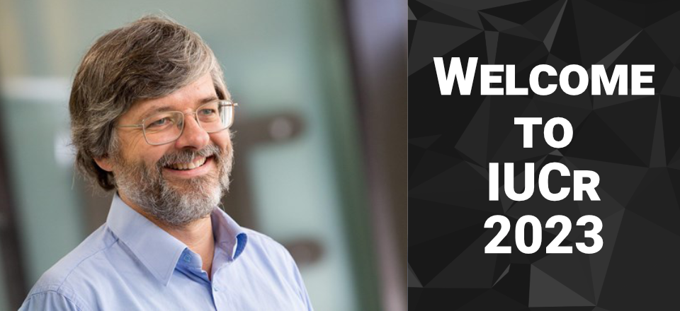
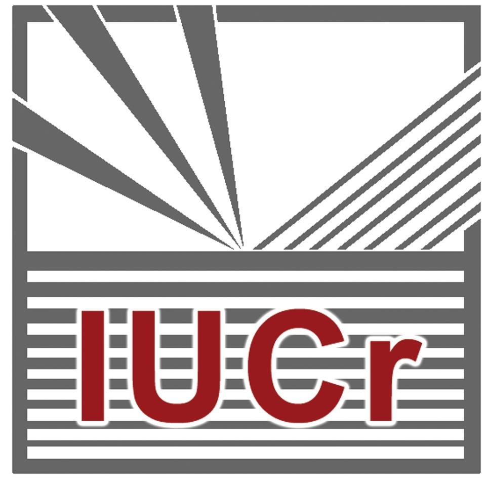

{: width="100%" .img-fluid .mb-4}

On behalf of the Local Organising Committee of the 26th Congress and General Assembly of the International Union of Crystallography and the Society of Crystallographers in Australia and New Zealand, we would like to extend our warmest invitation to you and your family to join us at the IUCr Congress in Melbourne, Australia from August 22-29, 2023.

The last congress to be held in Australia was in August 1987 in Perth. For those fortunate to attend it still holds fond memories, as well as having provided an ongoing legacy for crystallography in Australia. Building on the 1987 experience, our Congress will focus on equity, diversity and inclusiveness and we will achieve this, in part, through gender balance, strong international attendance and provision of family friendly facilities. A particular emphasis will be placed on student and early career researcher participation. This will enable us to deliver an outstanding scientific program that is accessible to all attendees.

Melbourne has been voted as world’s most liveable city for six consecutive years, attributed to its safety, diversity, ease of navigation and clean air. Melbourne is an accredited ‘Safe City’ by the World Health Organisation. It is also one of the most cosmopolitan and multicultural cities in the world, with restaurants catering to every cuisine imaginable and a thriving café culture. There are over 480,000 Asian language speakers, over 550,000 European language speakers (other than English), and over 230 languages and dialects spoken in Melbourne.

The land on which Melbourne lies is the home of the traditional custodians of the land, the Bunurong Boon Wurrung and Wurundjeri Woi Wurrung peoples of the Eastern Kulin Nation and continues to be a significant gathering place for Aboriginal and Torres Strait Islander peoples. Melbourne is also a great gateway to the rest of the Australia with the Great Ocean Road on its doorstep and well-connected flights to the rest of the country. This can be a once-in-a-lifetime opportunity to visit Australia, participate in this global gathering of crystallographers and like-minded scientists, and to experience the unique attractions that the destination has to offer.

##### See you in Melbourne in 2023!
{:.my-4}

**Professor Michael Parker**\
Chair, Local Organising Committee\
IUCr 2023

<!-- [Read more](./about.html){:.button .my-4} -->

##### Proudly hosted by
{:.mt-4}

  

    
  

  

    
  

