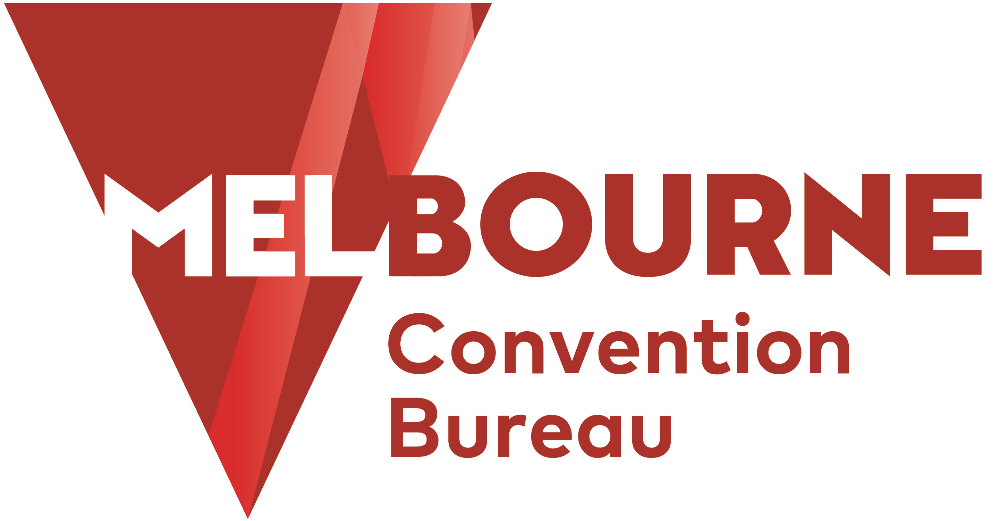
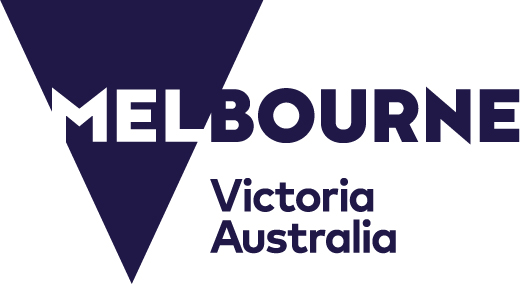
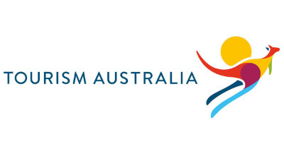

## Sponsorship

An exciting range of sponsorship opportunities will be developed, each containing benefits that will ensure your organisation receives maximum exposure. Sponsorship packages will be designed to suit a range of budgets. Early confirmation of your sponsorship will ensure an even higher level of exposure.
{:.mb-4}

## Exhibition

An important element of the Congress will be the exhibition of the latest products and services. The daily Congress program will be structured to give participants maximum opportunity to visit the exhibition. All lunches and refreshments will take place in the exhibition area.
{:.mb-4}

**For further information or to discuss how you could become involved in the Congress as a sponsor or exhibitor, contact the IUCR 2023 Secretariat:**

## Contact

**IUCR 2023 Congress Director**\
Emma Bowyer\
ICMS Australasia\
[emmab@icmsaust.com.au](mailto:emmab@icmsaust.com.au)\
+61 2 9254 5000

[Express your Interest in Sponsoring](https://icmsaust.eventsair.com/iucr-2023/expression-of-interest/Site/Register){:.button .text-center .my-4 target="_blank"}

### Supporters
{:.my-4}

  

  

  

