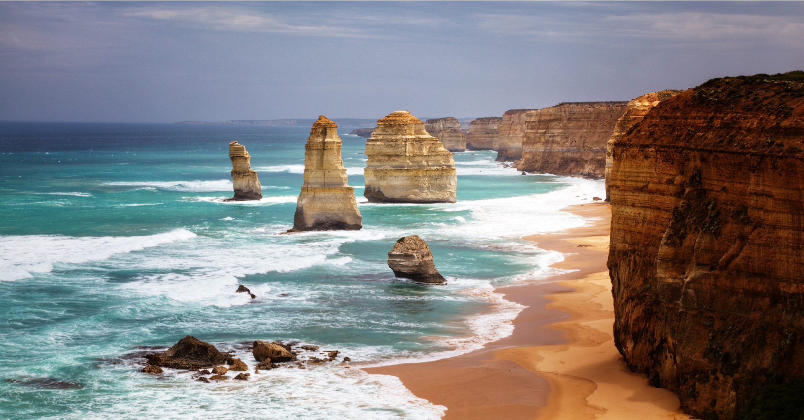

{: .img-fluid}

Visit Victoria in springtime whether you are visiting world class wineries, immersing yourself in the atmosphere of the AFL finals series or spending the day at one of Victoria’s sensational surf beaches there’s something to explore for everyone. Discover the diversity and beauty of regional Victoria, from world-class wineries to natural springs, coastal villages, peninsulas and alpine towns.  Drive one of the many scenic routes, pull on your walking boots and follow tracks and trails, or wander shops and produce markets.
